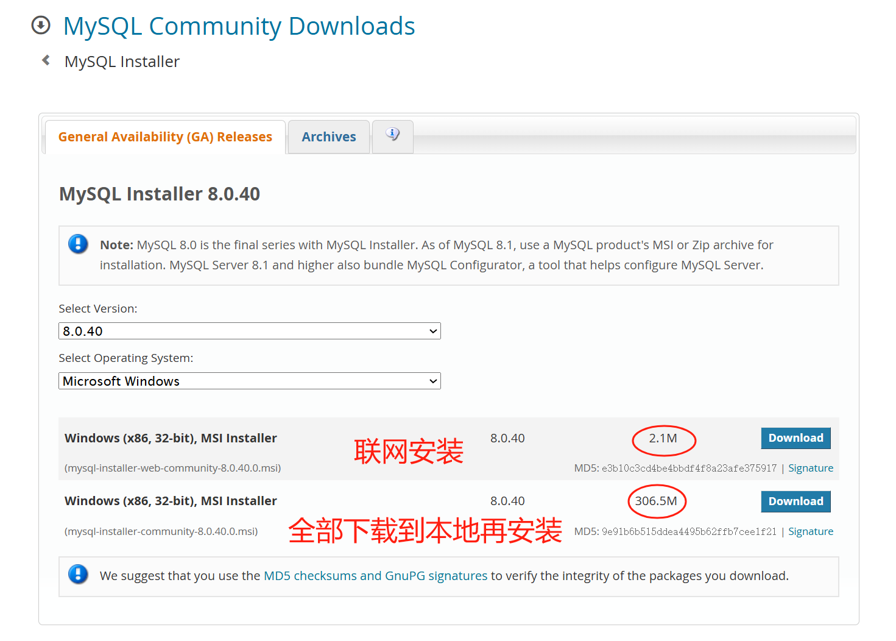
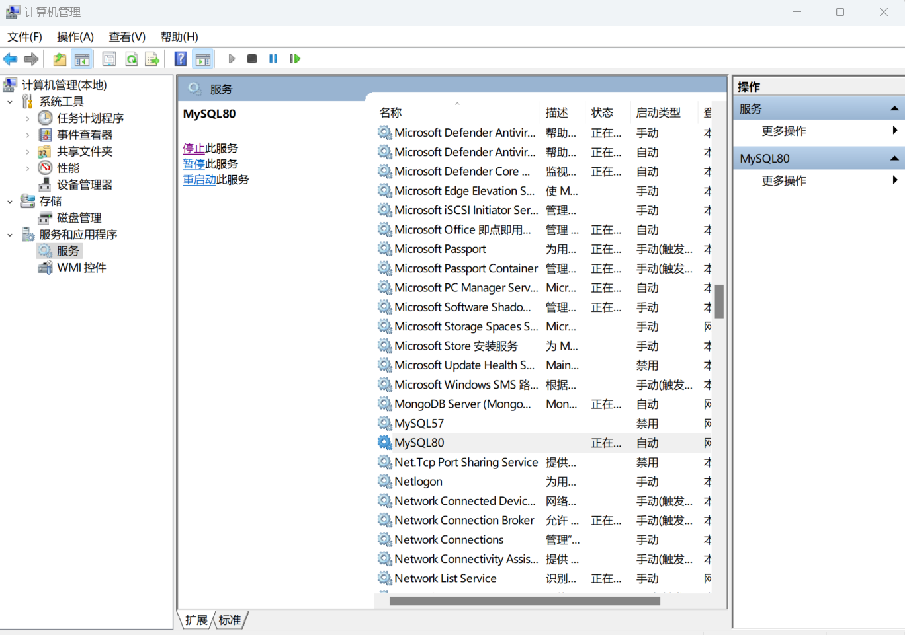

## 安装mysql
下载链接 https://www.mysql.com/cn/downloads/， 按图示下载即可。
仅社区版本可免费下载使用。

选择对应的操作系统。

无需登录、无需注册，直接下载。

安装模式一般选择第二种。

双击下载好的mysql-installer-community-x.x.x.x.msi文件安装，安装过程中仅2处需要手动选择、设置，其他地方一律采用默认选项直接点Next。
在select product界面我们仅选择MySQL Server。

需要设置root用户的密码。

安装完成后开机会默认启动MySQL server，在电脑的“计算机管理-->服务”里能看到MySQL，可以手动停止和重启该服务。


## 常用sql/'siːkw(ə)l/语句
注意：在sql语句里大写和小写是等价的。  
登录数据库`mysql -h localhost -P 3306 -u root -p`，-h数据库安装在哪台服务器上，-P数据库的工作端口号，-u用户名，-p密码（需要回车后再输入）。root用户的密码是在安装mysql的过程中指定的。    
建库`create database blog;`   
查看有哪些库`show databases;`  
创建普通用户`create user 'tester' identified by '123456';grant all on blog.* to tester;`tester是用户名，123456是密码。   
退出`exit;`  
以tester用户登录数据库：`mysql -h localhost -P 3306 -u tester -p`，然后输入tester用户对应的密码。  
选定某个库`use blog;`  
查看有哪些表`show tables;` 
建表
```sql
create table if not exists user(
	id int auto_increment comment '用户id，自增',
	name varchar(20) not null comment '用户名',
	password char(32) not null comment '密码的md5',
	create_time datetime default current_timestamp comment '创建时间',
	primary key (id),
	unique key idx_name (name)
)default charset=utf8mb4 comment '用户登录';
```
查看表结构`desc user;`  
查看建表语句`show create table user;`  
删除表`drop table user;`  
添加列`alter table user add phoone char(11) not null default '' comment '手机号';`  
修改加列`alter table user change phoone phone char(11) not null default '' comment '手机号';` 
添加索引`alter table user add index idx_phone(phone);`  
删除索引`alter table user drop index idx_phone;`  
删除列`alter table user drop phone;`  
插入数据
```sql
insert into user (name,password) values 
    ("dqq","e10adc3949ba59abbe56e057f20f883e"),
    ("dlm","e10adc3949ba59abbe56e057f20f883e");
```
查询
```sql
select name,password from user where name!='' and password!='' order by create_time limit 5,3;
```
修改
```sql
update user set name='zcy' where create_time>20250116;
```
删除
```sql
delete from user where create_time<20250101;
```