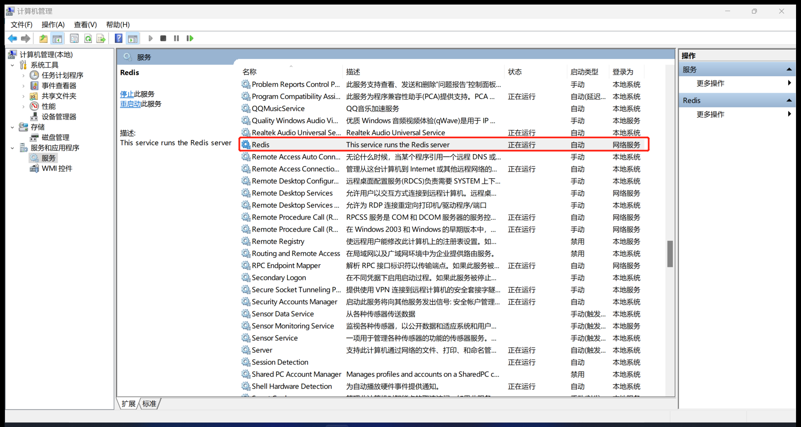
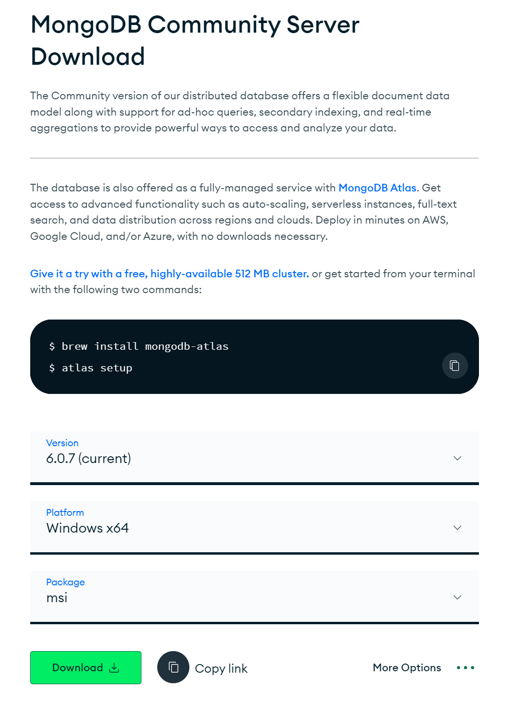
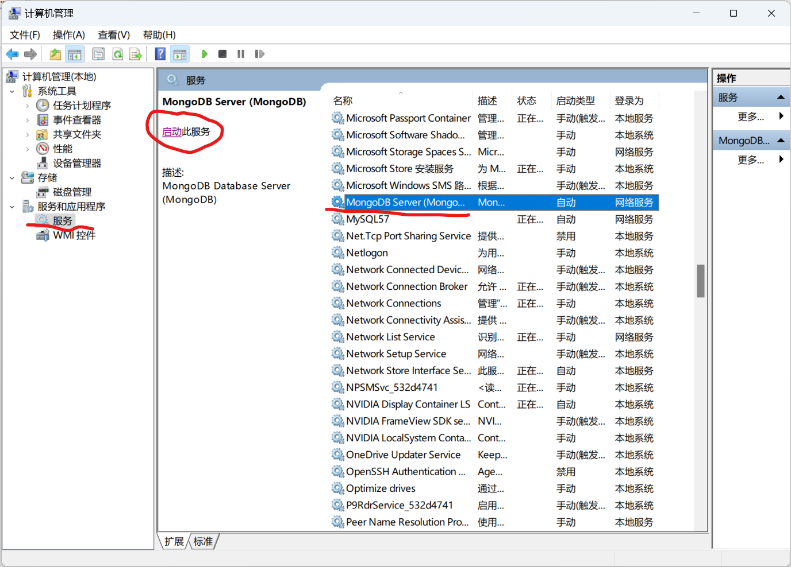

# Windows下安装数据库
## Redis安装
到https://github.com/MicrosoftArchive/redis/releases下载Redis-x64-xxx.msi，直接双击安装。  
安装完成后右键Windows徽标，点击计算机管理，在服务和应用程序下面点击服务，在服务区找到Redis，默认开机时它会自动启动。在左上方可以手动停止或重启Redis服务。只要它处于正在运行的状态，就可以执行相关的go代码了。    


## Mongo安装
下载链接https://www.mongodb.com/try/download/community，下载社区版：

直接双击下载好的msi文件安装即可，最后确保mongo server处于启动状态：


## ClickHouse安装
Win+R运行cmd，输入命令```wsl --install -d Ubuntu-22.04```，在windows上安装ubuntu子系统。（参考https://learn.microsoft.com/zh-cn/windows/wsl/install）
在cmd终端里输入```wsl```进入Ubuntu终端  

```Shell  
sudo -i     # 切换到root用户
mkdir clickhouse
cd clickhouse
curl https://clickhouse.com | sh    # 下载Clickhouse
 ./clickhouse install   # 安装Clickhouse
sudo clickhouse restart     # 重启Clickhouse
clickhouse-client --password    # 进入Clickhouse客户端
```
参考https://clickhouse.com/docs/knowledgebase/install-clickhouse-windows10