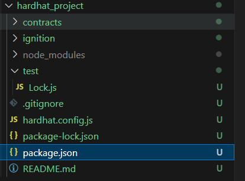
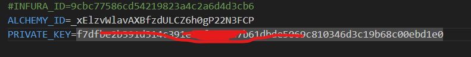

# 用Hardhat创建合约项目

## 参考:https://hardhat.org/tutorial

1. 进入项目根目录，执行`npm install --save-dev hardhat`安装hardhat.
2. `npx hardhat init 执行并按Enter键,等执行完成.项目此时被创建完成

   
3. 在contracts目录下编写好合约,进行编译：

   `npx hardhat compile`
4. 测试合约: npx hardhat test
5. 本地部署合约

   a.将合约部署到hardhat内置的本地网络，启动本地网络节点：npx hardhat node

   b.部署合约运行:npx hardhat ignition deploy ./ignition/modules/Ballot.js --network localhost [`--reset`]
6. 部署合约到测试网络

   a.安装并设置 MetaMask,获取账户私钥：PRIVATE_KEY

   b.Alchemy 或 Infura,获取api_key

   c.hardhat 中使用环境变量我们安装 dotenv :`npm install dotenv --save`

   d.新建.env

   

   e.在 Hardhat 配置⽂件 hardhat.config.js 中，加入 Sepolia 的配置

   ```
   require("@nomicfoundation/hardhat-toolbox");
   require("dotenv").config();

   /** @type import('hardhat/config').HardhatUserConfig */
   module.exports = {
     solidity: "0.8.28",
     networks: {
       hardhat: {},
       sepolia: {
         // url: "https://sepolia.infura.io/v3/" + process.env.INFURA_ID,
         url: "https://eth-sepolia.g.alchemy.com/v2/" + process.env.ALCHEMY_ID,
         accounts: [process.env.PRIVATE_KEY],
       },
     },
   };

   ```
   运行:npx hardhat ignition deploy ./ignition/modules/Ballot.js --network sepolia [`--reset`]
