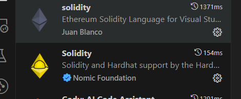

# 开发工具准备

## Visual Studio Code

用于开发solidity智能合约的IDE

## nodejs

Node.js是一个让 JavaScript 运行在服务端的开发平台，它让 JavaScript 成为与PHP、Python 等服务端语言平起平坐的脚本语言。
npm是一个管理javascript模块的工具，它内置在了nodejs中，所以安装nodejs的时候也一并把npm安装好了。
安装node，下载链接 https://nodejs.org/en/download/prebuilt-installer
安装好之后查看版本

```
node -v
npm -v
```

## git

版本管理

git -v

## solidity VS Code 扩展  (Hardhat)

可以以简化在 Ethereum 账本上创建、生成和部署智能合约的方式。 此扩展具有与 Truffle、Ganache 等工具和服务的内置集成。 我们将使用此扩展编写和测试智能合约.

在 Visual Studio Code 的左侧边栏中，选择“扩展”。 搜索“solidity”，然后选择Nomic 基金会的 Solidity插件进行安装。


