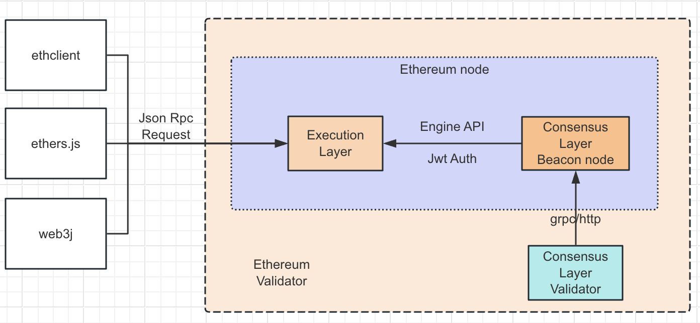

### 区块链技术原理（二）共识机制基础-权益证明（Proof of Stake, PoS）

##### 定义：

共识机制，需要验证者将有价值的东西存放的到网络中，当验证者行为不诚实时，这些有价值的东西会被销毁。用于确保网络中各个节点之间对交易记录的一致性。

节点根据它们在网络中所持有的代币数量和持有时间来决定谁有权进行区块的验证和生成。

##### 

##### 成为验证者：

想成为一个验证者，用户必须要质押32个ETH到质押合约，并且运行3个服务: 执行层客户端(EL, Execution Layer)、共识层客户端(CL, Consensus Layer)、验证者客户端(Validator)。

用户质押的ETH数量达到32个时，会被添加到激活队列中，这个队列专门是为了限制一个新的验证者被添加到网络中的几率，保证网络的稳定。

一旦激活，验证者将会从P2P网络收到新的区块。

当验证者想要退出并提现时，在共识层客户端通知执行层客户端生成区块时，使用withdrawals字段传递提现信息，并直接添加到账户的余额，这种方式不会消耗gas。

##### 区块生成过程：

每12秒为一个Slot，在一个Slot中，验证者提议和验证区块，保证区块以一定的频率被创建和添加到链上，并且在同一个Slot中，验证者只有一种角色。

在一个Epoch中，包含32个Slot，代表权益证明机制中一个完整的回合。

所有的验证者会被平均分配到各个Slot，且一个验证者在一个Epoch中会被分配到1个Slot中，每个Slot中所有的验证者组中一个委员会。

在一个Slot中，验证者会被分为两种角色，分别是提议者(Proposer)和见证者(Attester)。

提议者：只有一个，并需要在4秒内广播提议的区块。

见证者：一个Slot中没有被选为提议者的验证者都是见证者，投票证明提议者广播的区块为最新的区块。

一个Slot中，时间被分为3个阶段：

1. 提议区块：提议者产生一个新区块，并且在Slot的前4秒广播这个区块给委员会中其他的见证者。
2. 聚合证明：见证者投票这个新区块是否被接受。如果在证明截止时间之前，没有收到新的区块的广播，他们将投票支持之前接受的Head区块。
3. 广播投票：在最后4秒里，所有委员会成员广播投票结果，并发给下一个slot的提议者。

##### 执行交易

1. 用户使用私钥创建一个被签名过的交易，通过JSON RPC Request发送给EL。
2. EL收到交易后，验证交易的有效性，比如检查sender账户余额是否有足够的ETH和交易的签名信息。
3. 如果交易有效，则把交易保存到本地的mempool，并通过EL的 gossip 网络发送给其他的EL节点，其他的EL节点收到交易后也会把交易保存到自己的mempool中。
4. 当前Slot中的一个验证者被随机选择成为提议者，向本地的CL节点发送一个生成区块的请求，CL收到后，使用Engine API向EL节点发送请求，调用ForkChoiceUpdated方法。EL从mempool中取出交易执行，并生成ExecutionPayload信息后，返回PayloadId，这个PayloadId最终返回给提议者，提议者再使用PayloadId向CL查询，CL向EL查询，最后返回ExecutionPayload，经过CL处理，在经过提议者处理并广播出去
5. 其他CL节点通过gossip网络收到新的信标区块(Beacon Block)数据。然后发送ExecutionPayload数据给EL，EL执行其中的交易后并验证状态有效后，见证者投票证明区块有效性后，将区块保存到本地数据库。
6. 交易在经过两个检查点后，将被确认为finalized状态。检查点只会是epoch的第一个slot。所以经过两个检查点就必须是交易经过了一个完整的epoch和下一个epoch的首个slot区块的确认。

奖励与惩罚行为在每个Epoch中只会触发一次，因此验证者想要获得奖励，至少要从激活到退出这个时间段内，参与共识网络一个完整的epoch周期才可以获得。

##### 验证者的余额

在以太坊的权益证明的共识机制中，定义了验证者的余额。
由于质押资产的特殊性，当前以太坊的Beacon链维护了验证者的两个单独的记录：

- 实际余额(Actual balance): 验证者实际持有资产的余额数值。包含了验证者存到合约中的金额、参与共识所获得的奖励、减去不活动的罚款。
- 有效余额(Effective balance): 有效余额是根据实际余额衍生出来的，并且被设计为一个Epoch变化一次，并且一整数个ETH计算(无小数)，在计算上更快。上限是32ETH，因此验证者实际余额可能是100ETH，但是有效余额只有32ETH。

##### 奖励分配：

1. 验证区块，大部分奖励都是从这个渠道获取的
2. 提议创建一个区块，由于一个Epoch里面只有32个验证者会被选为提议者，所以这种方式获取的奖励非常稀少。
3. 参与同步委员会奖励，每256个Epoch(27.3个小时)会选出512个验证者参与同步委员会，目前估算时至少需要22个月才能获得一次奖励。

##### 奖励接收

所有的奖励会被记录在Beacon链上，当有奖励发放时，在提议者提议新区块时，会构建一个最多包含16个提现请求的队列，根据协议规则判断账户是否有合格的提款，有就添加到队列。如果超过长度，下一个提议者会从上次中断的地方继续，按照顺序安排提现。

这个提现方式并不是按照执行交易的方式执行，与PoW发放奖励的机制类似，是在执行层Finalize区块的时候直接把提现金额添加到账户地址的余额上。不需要额外的gas。

由于这种发放方式是每个区块只会处理16个地址，因此奖励发放较慢，现在至少1周才可以收到奖励。

奖励的方法方式与验证者提现方式一致，**在共识层客户端通知执行层客户端生成区块时，使用withdrawals字段传递提现信息，并直接添加到账户的余额，这种方式不会消耗gas。**

##### 欺诈惩罚：

目前惩罚主要针对的是证明者和参与同步委员会中的验证者。

###### 提议者惩罚

目前区块的提议者没有明确的惩罚。如果区块提议者未能提出区块，或者区块无效，在那个slot中会出一个空块，然后开始下一个slot。
个人理解：提议者的没有明确惩罚的原因

1. 是其恶意行为不能被明显的感知到
2. 每个验证者成为提议者的概率很低

###### 认证惩罚

证明缺失、迟交、不正确均会收到惩罚。

不活跃的惩罚会随着时间推移成倍增加，减少不活跃的验证者在网络中的权益，让他们控制的总权益占比少于1/3。

惩金与能够获得的奖励相同。

###### 同步委员会惩罚(Sync committee Penalties)

同步委员会验证者会在签署的每个Slot中签署正确的Head区块都会获得奖励。

没有参与但是参加了同步委员会的验证者会受到惩罚。

罚金与奖励金额相同。
