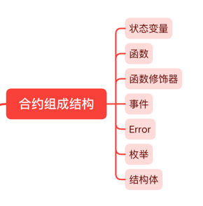
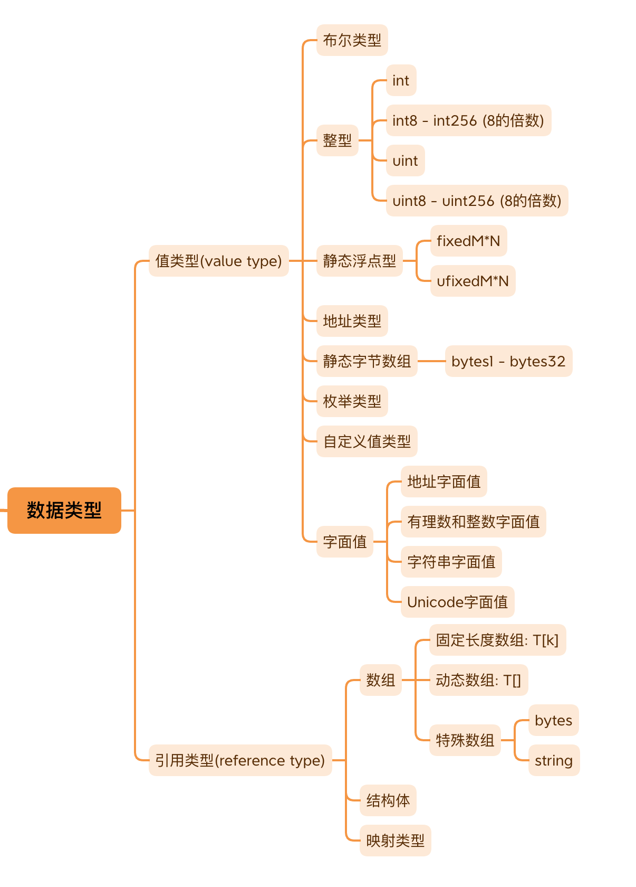

一.使用Solidity 编写 Ethereum智能合约:
1.安装vs code 和 Nomic Foundation 的 solidity VS Code 扩展  node.js  git
2.安装hardhat
npm install --save-dev hardhat

npm install --save-dev hardhat # 安装hardhat

# 安装成功后的hardhat命令

npx hardhat init    # 初始化一个hardhat项目
npx hardhat compile # 编译
npx hardhat test    # 测试
npx hardhat run     # 执行脚本

新建项目:
1.打开终端：mkdir  文件夹名称
2.进入文件夹，初始化项目: npx hardhat init
3.npx hardhat compile
4.启动本地网络：npx hardhat node
5.部署合约,运行： npx hardhat ignition deploy ./ignition/modules/Lock.js --network localhost --reset
(主要执行命令称呼 depolyCmd 如下 npx hardhat ignition depoly 合约部署脚本位置 --network 你希望部署的网络 如果你部署过一次，这里会产生缓存 解决的方法是在 前面的 depolyCmd 后面 加一个参数 --reset)

二.solidity合约组成结构：

状态变量
函数 ：普通函数 构造函数(用于初始化合约的状态，只在合约创建时执行一次)
函数修饰器：用于修改或限制函数的行为，增强函数的复用性和安全性。
事件：用于记录合约中发生的特定操作，类似于日志功能，便于外部监听和响应合约的活动
error
枚举
结构体

<!-- 
自定义值类型定义
using语句：当前合约能够使用指定库中定义的函数或类型，无需显式调用，简化代码并增强功能
fallback函数定义：当调用合约的函数不存在时执行的特殊函数，用于处理意外的函数调用或额外的数据。
receive函数定义：专门用来接收以太币（Ether）转账的特殊函数，当合约被发送以太币且未调用任何函数时触发
-->

demo:

// SPDX-License-Identifier: GPL-3.0

pragma solidity ^0.8.17;

contract Owner {

// 结构体
struct Identity {
    address addr;
    string name;
}

// 枚举
enum State {
    HasOwner,
    NoOwner
}

// 事件
event OwnerSet(address indexed oldOwnerAddr, address indexed newOwnerAddr);
event OwnerRemoved(address indexed oldOwnerAddr);

// 函数修饰器
modifier isOwner() {
    require(msg.sender == owner.addr, "Caller is not owner");
    _;
}

// 状态变量
Identity private owner;
State private state;

// 下面的都是函数

// 构造函数
constructor(string memory name) {
    owner.addr = msg.sender;
    owner.name = name;
    state = State.HasOwner;
    emit OwnerSet(address(0), owner.addr);  //使用emit关键字触发事件
}

// 普通函数
function changeOwner(address addr, string calldata name) public isOwner {
    owner.addr = msg.sender;
    owner.name = name;
    emit OwnerSet(owner.addr, addr);
}

// 普通函数
function removeOwner() public isOwner {
    emit OwnerRemoved(owner.addr);
    delete owner;
    state = State.NoOwner;
}

// 普通函数
function getOwner() external view returns (address, string memory) {
    return (owner.addr, owner.name);
}

// 普通函数
function getState() external view returns (State) {
    return state;
}
}

三.solidity数据类型:

数据类型分类：Solidity 中的数据类型主要分为值类型和引用类型。
值类型：这类变量直接存储实际的数据内容。当这些变量在赋值或传递参数时，进行的是值传递，即数据的直接拷贝。
引用类型：这类变量存储的是数据的存储地址。在赋值或传递参数时，进行的是引用传递，即地址的拷贝。不过，这也受到数据位置（datalocation）的影响。
Solidity 中的值类型：包括布尔类型、整型、枚举类型、静态浮点型、静态字节数组、自定义值类型等。
Solidity 中的引用类型：包括数组、结构体、映射类型。
值与引用的行为差异：在函数内部修改引用类型变量的值会影响到原始变量，而修改值类型变量则不会影响原始数据。

四.Solidity 中有三种数据存储位置，分别指定变量的存储方式:

storage：数据永久存储在区块链上，其生命周期与合约本身一致。
memory：数据暂时存储在内存中，是易失的，其生命周期仅限于函数调用期间。
calldata：类似于 memory，但用于存放函数参数，与 memory 不同的是，calldata 中的数据不可修改且相比 memory 更节省 gas

在Solidity中，声明「引用类型」时必须指定数据位置（data location），这是为了明确变量的存储方式和生命周期
状态变量默认存储在 storage

五.Solidity 的整型运算可能会出现溢出的情况
在版本 <0.8.0 的 Solidity 中，可以使用 OpenZeppelin 的 SafeMath 库来防止整型溢出。
在版本 >=0.8.0 的 Solidity 中，如果整型溢出，交易会被终止。
六.自定义值类型
通过 type C is V 可以定义新的"自定义值类型"
eg: type Weight is uint128;
需要使用强制类型转换进行转换
七.数组
静态数组：T[arrSize] DataLocation arrName;
uint[3] memory arr; //所有元素都是0
uint[3] memory arr = [uint(1000), 1001, 1002];
数组，无论是静态还是动态，都具有一个成员变量：length
动态数组：T[] DataLocation arrName;
uint[] storage storageArr = [uint(1), 2]; // 动态数组只有在storage位置才能用数组字面值初始化
uint[] memory arr = new uint;
只有当动态数组的数据位置为存储（storage）时，才可以使用成员函数 push(), push(x), 和 pop()
push()：在数组末尾增加一个元素，并赋予零值，使得数组长度增加一。
push(x)：将元素 x 添加到数组末尾，同样使数组长度增加一。
pop()：从数组末尾移除一个元素，导致数组长度减少一。
数组切片：数组切片是数组的一段连续部分，通过 [start:end] 的方式定义
_// 如果输入"abcdef"，将会输出"abcd"_
function extracFourBytes(string calldata payload) public view {
string memory leading4Bytes = string(payload[:4]);
console.log("leading 4 bytes: %s", leading4Bytes);
}
只能对 calldata 使用数组切片；由于calldata 数据不可更改，因此无法对数组切片的值进行修改
多维数组：T[col][row] DataLocation arrName;
动态字节数组类型：bytes 和 string
使用 bytes(str) 可以将 string 类型转换为 bytes 类型
使用 string(myBytes) 可以将 bytes 类型转换成 string 类型
bytes 类型类似于一个 bytes1[] 数组；string 类型在内部结构上与 bytes 类型基本相同，但它不支持下标访问和长度查询
八.结构体
struct StructName{}
StructName DataLocation varName;

struct Book {
string title; _// 书名
uint price;   _// 价格
//string[] author; _// 作者
}
Book memory book;
Book memory book2 = Book("my book title", 25);
Book memory book1 = Book(
{
title: "my book title",
price: 25
}
);
结构体可以和数组，映射类型互相嵌套；mapping(uint => Book) lib; // 从 ISBN 到 Book 的映射关系
不能包含自身类型作为成员
九.映射：mapping(KeyType => ValueType) varName;
映射类型只能声明在 storage
映射类型作为入参和返回值时，函数可见性必须是 private 或 internal
无 length 属性；无法直接遍历
从映射中删除一个键的值，只需使用delete关键字，但键本身不会被移除，只是值被重置为默认值
delete balances[userAddr];
十.异常处理：olidity 异常处理的统一原则是状态回滚（state reverting）
require:
require(condition, "My error string");
1.检查输入参数：验证传入函数的参数是否满足预期，确保它们在合理的范围或状态。
2.检查操作结果：确保某些操作的结果如预期一样有效，例如，从某个函数调用返回的值。
3.预检条件：在执行函数的主要逻辑之前，确认所有必要的条件都已经满足。
assert:
assert(condition);
1.检查不变性（invariant）：例如 ERC20 合约中，所有账户的 balance 之和应该与 totalSupply 相等
2.防止那些不应该出现的情况出现
3.修改合约状态后，检查合约内部状态是否符合预期
revert:
// 使用方式一
revert CustomError(arg1, arg2);
// 使用方式二
revert("My Error string");

require: 通常用于验证外部输入、处理条件和确认合约的交互符合预期。它主要用于可恢复的错误或者在正常的业务逻辑中检查条件，比如验证用户输入、合约状态条件或执行前的检查。如果 require 检查失败，会撤销所有修改并退还剩余的 gas。
assert: 用于检查代码逻辑中不应发生的情况，主要是内部错误，如不变量的检查或某些后置条件，这些通常指示合约存在 Bug。assert 应仅在确定有逻辑错误时使用，因为如果 assert 失败，它表示一个严重的错误，通常是编码或逻辑错误，需要马上修复。与 require 不同，assert 失败将消耗所有提供的 gas，并回滚所有修改。

eg:
function splitEther(address payable addr1, address payable addr2) public payable {
require(msg.value % 2 == 0, "Even value required."); // 检查传入的ether是不是偶数
<!-- 等价于
if (msg.value % 2 == 0) {
revert("ven value required.");
} -->
uint balanceBeforeTransfer = address(this).balance;
addr1.transfer(msg.value / 2);
addr2.transfer(msg.value / 2);
assert(address(this).balance == balanceBeforeTransfer); // 检查分账前后，本合约的balance不受影响
}

自定义错误:通过 error 关键字声明,减少 Gas 消耗
pragma solidity ^0.8.0;
contract CustomErrorExample {
error Unauthorized(address caller);  // 自定义错误
address public owner;
constructor() {
owner = msg.sender;
}
function restrictedFunction() public {
if (msg.sender != owner) {
revert Unauthorized(msg.sender);  // 使用自定义错误
}
}
}

try/catch结构处理外部合约调用中的异常
十一.constant:
eg：uint constant ratio = 3;
必须在声明的时候赋值（初始化）;一旦赋值不能更改
immutable：
在声明的时候对 immutable 变量初始化:uint immutable n = 5;
或者
在构造函数初始化:
uint immutable n;
constructor () {
n = 5;
}
十二.solidity函数

function 函数名(< 参数类型 > < 参数名 >) < 可见性 > < 状态可变性 > [returns(< 返回类型 >)] {
// 函数体
}
function functionName(parameter-list) custom modifiers['visibility','state mutability','modifiers'] returns(return-list){

}
parameter-list, state-mutability, modifiers,returns(return-list) 都是可选的

visibility:函数可见性，决定了函数的访问范围;internal（仅限合约内部和继承的合约）、external（仅限外部调用）、private（仅限当前合约）、public（无限制访问，函数默认的可见性级别）
state mutability:函数的状态可变性，表明函数是否会修改或读取合约的状态;pure（不读取也不修改状态）、view（只读状态不修改）、payable（可以接收以太币）
1.怎样才算查询合约状态：
读取状态变量：直接访问合约中定义的任何状态变量。
访问余额：使用 address(this).balance 或 <address>.balance 来获取合约或任何地址的当前以太币余额。
访问区块链特性：通过 block，tx，msg 等全局变量的成员访问区块链的特定数据。例如，block.timestamp 获取区块的时间戳，msg.sender 获取消息发送者的地址。
调用非 pure 函数：任何未明确标记为 pure 的函数调用。即便函数本身没有修改状态，但如果它没有被标记为 pure，调用它仍被视为状态查询。
使用内联汇编：特别是那些包含某些操作码的内联汇编，这些操作码可能会读取或依赖于链上数据。
2.怎样才算修改合约状态
修改状态变量：直接改变存储在合约中的任何状态变量的值。
触发事件：在合约中发出事件，这通常用于记录合约活动，尽管本身不改变任何存储的状态变量，但被视为状态改变，因为它改变了链上的日志。
创建其他合约：通过合约代码创建新合约实例。
使用 selfdestruct：销毁当前合约，并将剩余的以太币发送到指定地址。
通过函数发送以太币：包括使用 transfer 或 send 方法发送以太币。
调用非 view 或 pure 的函数：调用任何可能改变状态的函数，如果函数未明确标记为 view 或 pure，则默认可能修改状态。
使用低级调用：如 call、delegatecall、staticcall 等。这些低级函数允许与其他合约交互，并可能导致状态变化。
使用含有特定操作码的内联汇编：特定的汇编代码可能直接修改状态，例如直接写入存储或执行控制合约资金的操作。
modifier:函数修饰器
modifier modifierName {
_// modifier body 1_
_;
_// modifier body 2_
}
使用 _ 占位符，这个占位符指示函数主体应该在何处执行
receive函数：只能在合约接受纯转账（msg.data 为空）时被触发
receive() external payable {
_// 函数体_
}
合约没有定义 receive 和 fallback 函数时，不能对其转账
以太币转账指的是纯转账
Solidity 中，有三种方法可以进行以太币转账：
send(amount)：发送 amount 数量的以太币，固定使用 2300 gas，错误时不会 revert，只返回布尔值表示成功或失败。
transfer(amount)：发送 amount 数量的以太币，固定使用 2300 gas，错误时会 revert。
call{value: amount}("")：发送 amount 数量的以太币，gas 可以自由设定，返回布尔值表示成功或失败
fallback()函数：
可以在以下两种情况下兜底：
receive 函数不存在（因为没有定义）
普通函数不存在（因为没有定义）
fallback() external [payable] {
_// 函数体
}
函数重载:Solidity 支持同名函数的重载，前提是参数列表不同
十三.继承
1.关键字 is 来表示继承关系，支持多继承，子合约可以访问父合约的所有非私有成员
contract Named is Owned, Mortal {
// Named 合约继承了 Owned 和 Mortal
}
2.子合约可以通过重写函数改变父合约的行为：父合约中的虚函数（使用 virtual 关键字修饰）可以在子合约中被重写。重写的函数必须使用 override 关键字，eg:
contract Base {
function foo() virtual public {}
}

contract Middle is Base {}

contract Inherited is Middle {
function foo() public override {}
}
十四.抽象合约：
如果一个合约中有未实现的函数，该合约必须标记为 abstract，这种合约不能部署。
抽象合约通常用作父合约
纯虚函数没有实现，用 virtual 关键字修饰，并且声明以分号 ; 结尾
eg:
abstract contract A {
function get() virtual public;
}
十五.接口
通过 interface 关键字定义，接口中的所有函数默认为 external，隐式地标记为 virtual，且不带实现
interface IToken {
function transfer(address recipient, uint256 amount) external;
}
接口与抽象合约的区别:
抽象合约可以包含部分已实现的函数，但接口不实现任何函数。
抽象合约可以定义构造函数、状态变量、结构体和枚举，而接口不可以。
接口中的所有函数都隐式地标记为 virtual，这意味着它们需要在实现合约中被重写

eg:
// 定义一个接口 IToken
interface IToken {
function transfer(address recipient, uint256 amount) external;
}
// 实现接口的合约
contract SimpleToken is IToken {
mapping(address => uint256) public balances;
constructor() {
balances[msg.sender] = 1000;  // 初始化代币余额
}
// 实现接口中的 transfer 函数
function transfer(address recipient, uint256 amount) public override {
require(balances[msg.sender] >= amount, "Insufficient balance");
balances[msg.sender] -= amount;
balances[recipient] += amount;
}
}
十六.库的使用：
通过关键字 library 定义，eg:
pragma solidity >=0.5.0;
library SafeMath {
function add(uint a, uint b) internal pure returns (uint) {
uint c = a + b;
require(c >= a, "SafeMath: addition overflow");
return c;
}
}
内嵌库:如果库函数都是内部函数（internal），编译器会将库函数的代码直接嵌入到调用合约中。库不会被单独部署，这种方式称为“内嵌库”
链接库:当库函数是公共或外部函数时，库可以单独部署，称为“链接库”
using for 语法扩展库的使用,eg:
contract TestLib {
using SafeMath for uint;
function add(uint x, uint y) public pure returns (uint) {
return x.add(y);  // 直接在 uint 类型的变量上调用库函数
}
}
十七.OpenZeppelin
使用 OpenZeppelin 库，可以通过 npm 来安装 OpenZeppelin:
npm install @openzeppelin/contracts
